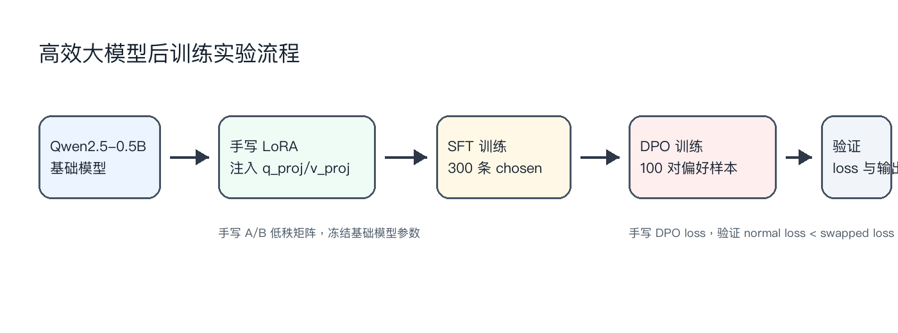
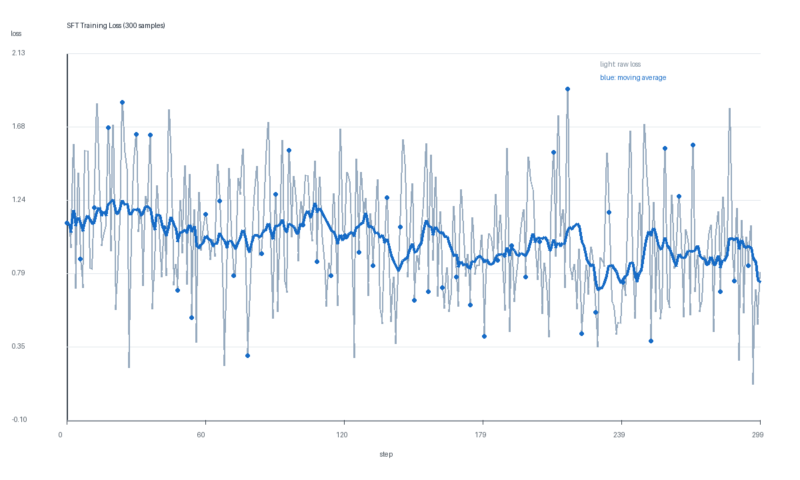
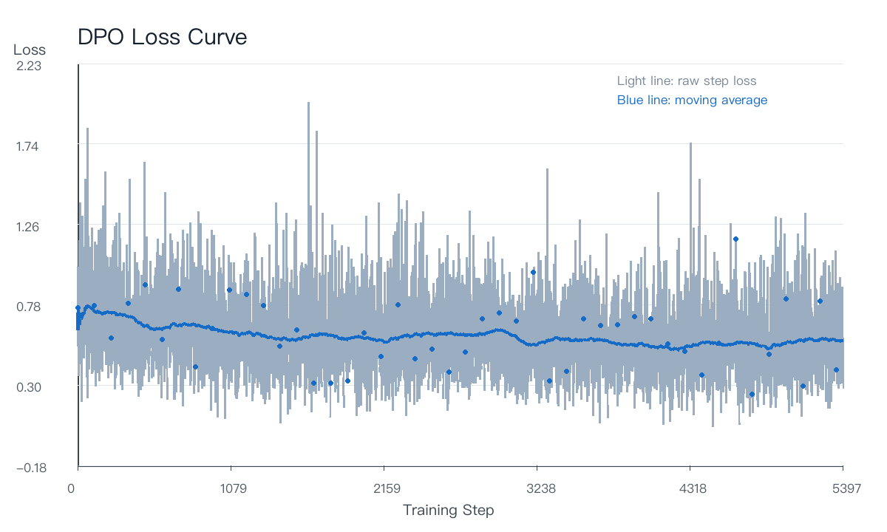

# Lab2：高效大模型后训练流水线实验报告

## 1. 实验概述

本实验围绕 **Parameter-Efficient Fine-Tuning、Alignment 与 Reasoning** 展开，目标是在有限计算资源下完成一个可验证的大模型后训练流程。实验使用 `Qwen/Qwen2.5-0.5B-Instruct` 作为基础模型，使用 `xinlai/Math-Step-DPO-10K` 数据集中的数学推理偏好样本，完成以下内容：

- 手写 LoRA adapter，并注入 Transformer 注意力模块中的 `q_proj` 与 `v_proj`。
- 使用 `chosen` 回答进行 LoRA SFT 训练。
- 手写 DPO loss，并先进行 chosen/rejected 交换验证。
- 在 100 对偏好样本上完成完整 DPO 小规模训练。
- 对比 Base Model 与后训练模型的输出差异。

本实验重点不是追求最终 benchmark 分数，而是验证后训练流水线的实现正确性。

## 2. 实验配置

| 项目 | 配置 |
|---|---|
| 基础模型 | `Qwen/Qwen2.5-0.5B-Instruct` |
| 数据集 | `xinlai/Math-Step-DPO-10K` |
| SFT 数据 | `prompt -> chosen` |
| DPO 数据 | `prompt + chosen + rejected` |
| SFT 样本数 | 300 |
| DPO 样本数 | 100 pairs |
| GPU | RTX 4090D 24GB |
| LoRA 注入位置 | `q_proj`、`v_proj` |
| LoRA rank | 8 |
| LoRA alpha | 16 |
| 可训练参数 | 540,672 / 494,573,440 |
| 可训练参数比例 | 0.11% |

## 3. 后训练流程架构



整体流程如下：

1. 加载基础模型 `Qwen2.5-0.5B-Instruct`。
2. 冻结基础模型原始参数。
3. 在注意力模块的 `q_proj` 和 `v_proj` 上注入手写 LoRA adapter。
4. 使用数学推理数据中的 `chosen` 回答进行 SFT。
5. 使用 SFT 后的 LoRA adapter 初始化 policy model。
6. 使用冻结的 base model 作为 reference model。
7. 使用 chosen/rejected 偏好对进行 DPO 训练。
8. 通过 loss 曲线、DPO 交换验证和输出对比验证实验结果。

## 4. LoRA 实现说明

本实验没有使用 `peft.LoraConfig` 实现核心 LoRA 逻辑，而是手写了 `LoRALinear`。

LoRA 的核心形式为：

```text
y = Wx + scale * B(Ax)
scale = alpha / rank
```

其中：

- `W` 是基础模型原始线性层权重。
- `A` 是降维矩阵，对应代码中的 `lora_a`。
- `B` 是升维矩阵，对应代码中的 `lora_b`。
- 原始 `W` 参数被冻结。
- 只有 `lora_a` 和 `lora_b` 参与训练。

代码中还额外验证了：

- base layer 权重被冻结。
- LoRA adapter 参数可训练。
- 初始 `lora_b` 为 0 时，LoRA 层输出与原始 base layer 输出一致。
- LoRA adapter 会继承 base layer 的 device 和 dtype，避免 GPU 训练时出现 CPU/GPU 混用错误。

## 5. SFT 训练结果

当前报告曲线来自调试阶段的 300 条 `prompt -> chosen` 样本，训练参数如下：

```bash
/root/miniconda3/bin/python -m src.train_sft \
  --model Qwen/Qwen2.5-0.5B-Instruct \
  --data_file data/math_step_dpo_train.parquet \
  --samples 300 \
  --max_length 512 \
  --batch_size 1 \
  --gradient_accumulation_steps 8 \
  --epochs 1 \
  --rank 8 \
  --alpha 16
```

训练结果：

| 指标 | 数值 |
|---|---:|
| 训练样本数 | 300 |
| 可训练参数 | 540,672 |
| 总参数量 | 494,573,440 |
| 可训练比例 | 0.11% |
| 最终 SFT loss | 0.7964 |

### SFT Loss 曲线



### 为什么 loss 曲线波动很大

曲线波动较大是正常现象，主要原因有四点：

1. **batch size 很小**：本实验使用 `batch_size=1`，每一步 loss 只对应单条样本，随机性很强。
2. **数学题难度不均匀**：不同样本的推理步骤长度、答案形式和难度差异较大，导致单步 loss 不稳定。
3. **样本量较小**：SFT 只训练 300 条样本，目标是验证流程正确，而不是充分收敛。
4. **逐步 loss 本身噪声大**：报告中浅色线表示原始逐步 loss，蓝色线表示滑动平均趋势，分析时应主要看平均趋势和后续验证结果。

因此，loss 曲线不需要像大规模训练那样平滑下降。这个实验更重要的是证明 LoRA 参数能训练、loss 能正常计算、adapter 能保存，并且后续 DPO 验证结果符合预期。

如果按 RTX 4090D 24GB 显存进行正式重跑，项目中的默认参数已调整为全量数据与更高 micro batch。推荐命令如下：

```bash
/root/miniconda3/bin/python -m src.train_sft \
  --model Qwen/Qwen2.5-0.5B-Instruct \
  --data_file data/math_step_dpo_train.parquet \
  --max_length 1024 \
  --batch_size 16 \
  --gradient_accumulation_steps 1 \
  --epochs 2 \
  --rank 32 \
  --alpha 64 \
  --lr 2e-5
```

## 6. DPO 实现与训练

DPO loss 手写实现如下逻辑：

```text
loss = -log sigmoid(
  beta * [
    (logp_policy_chosen - logp_policy_rejected)
    - (logp_ref_chosen - logp_ref_rejected)
  ]
)
```

DPO 训练中：

- policy model 使用 SFT 后的 LoRA adapter 初始化。
- reference model 使用原始 base model，并完全冻结。
- chosen 和 rejected 分别计算 sequence log probability。
- 梯度只回传到 policy model 的 LoRA 参数。

当前报告曲线来自调试阶段的 100 对偏好样本，DPO 训练命令：

```bash
/root/miniconda3/bin/python -m src.train_dpo \
  --model Qwen/Qwen2.5-0.5B-Instruct \
  --init_adapter_dir outputs/sft_lora \
  --output_dir outputs/dpo_lora \
  --data_file data/math_step_dpo_train.parquet \
  --samples 100 \
  --max_length 512 \
  --batch_size 1 \
  --gradient_accumulation_steps 4 \
  --epochs 1 \
  --rank 8 \
  --alpha 16 \
  --lr 1e-5 \
  --beta 0.1
```

训练结果：

| 指标 | 数值 |
|---|---:|
| DPO 偏好样本数 | 100 pairs |
| DPO 训练耗时 | 约 29 秒 |
| DPO 最终 loss | 0.6822 |

如果按 RTX 4090D 24GB 显存进行正式 DPO 重跑，推荐使用全量偏好数据和更高 micro batch：

```bash
/root/miniconda3/bin/python -m src.train_dpo \
  --model Qwen/Qwen2.5-0.5B-Instruct \
  --init_adapter_dir outputs/sft_lora \
  --output_dir outputs/dpo_lora \
  --data_file data/math_step_dpo_train.parquet \
  --max_length 1024 \
  --batch_size 8 \
  --gradient_accumulation_steps 1 \
  --epochs 2 \
  --rank 32 \
  --alpha 64 \
  --lr 1e-5 \
  --beta 0.1
```

### DPO Loss 曲线



DPO loss 曲线同样存在波动，原因与 SFT 类似，但还额外受到 chosen/rejected 差异大小的影响。某些偏好对中 chosen 和 rejected 区分明显，loss 会较低；某些偏好对差异较小或文本长度较长，loss 会更高。因此逐步 DPO loss 抖动是合理的。

## 7. DPO 验证结果

为了验证 DPO loss 的方向正确性，实验分别计算：

1. 正常顺序：`chosen` 作为正样本，`rejected` 作为负样本。
2. 交换顺序：将 `chosen` 和 `rejected` 对调。

验证结果：

```text
DPO normal loss: 0.532641
DPO swapped loss: 1.022753
Batch size: 16
```

| 指标 | 数值 |
|---|---:|
| Normal DPO loss | 0.532641 |
| Swapped DPO loss | 1.022753 |
| Batch size | 16 |

可以看到：

```text
normal loss < swapped loss
0.532641 < 1.022753
```

这说明模型对 chosen/rejected 的偏好方向能够被 DPO loss 区分出来，手写 DPO loss 的计算逻辑是有效的。

## 8. Base Model 与后训练模型输出对比

完整输出见 `outputs/base_vs_lora.md`。下面展示两个例子。

### 示例 1

**Prompt**

```text
If 3x + 5 = 20, what is x? Show the steps.
```

**Base Model 输出摘要**

```text
To solve for x in 3x + 5 = 20, subtract 5 from both sides, get 3x = 15,
then divide both sides by ...
```

**Fine-tuned Model 输出摘要**

```text
To solve for x in 3x + 5 = 20, subtract 5 from both sides to move the
constant term to the right side, get 3x = 15, then divide both sides ...
```

两个模型都能给出基本正确的解题步骤，Fine-tuned 版本在表达上更贴近逐步推理格式。

### 示例 2

**Prompt**

```text
A rectangle has length 12 and width 7. What is its area?
```

**Base Model 输出摘要**

```text
Area = Length × Width
Area = 12 × 7
Area = 84
```

**Fine-tuned Model 输出摘要**

```text
The area would be 12 × 7 = 84. The answer is: 84
```

Fine-tuned 模型输出更短，并直接给出答案。对于简单数学题，这种输出更接近最终解答形式。

## 9. AI Collaboration Diary

### 9.1 LoRA 代码搭建

**Prompt**

```text
根据实验二目标搭建数学推理 LoRA + DPO 项目骨架。
```

**Iteration**

初始代码通过了本地单元测试，但在云端 GPU 训练时出现：

```text
Expected all tensors to be on the same device, but found cuda:0 and cpu
```

原因是模型已经移动到 GPU，但新注入的 LoRA adapter 默认创建在 CPU 上。

**Verification**

修复后让 `lora_a` 和 `lora_b` 继承 base layer 的 `device` 和 `dtype`，并补充单元测试验证：

- LoRA base 权重被冻结。
- LoRA adapter 参数可训练。
- adapter dtype 与 base layer 一致。

**Learning**

LoRA 的正确性不只包括公式，还包括参数冻结、梯度范围、device/dtype 一致性。

### 9.2 Hugging Face 下载问题

**Prompt**

```text
数据集下载卡在 0%，并且报 IncompleteRead 或 Xet 401。
```

**Iteration**

先遇到 `hf-xet` 401 错误，随后又遇到 parquet 文件下载中断：

```text
IncompleteRead(...)
ChunkedEncodingError
```

**Verification**

解决方式：

- 禁用 Hugging Face Xet 下载路径。
- 支持 `--data_file` 读取本地 parquet。
- 用 `curl -C - --retry` 断点续传下载数据集文件。

**Learning**

在网络不稳定的云端环境中，实验应避免完全依赖隐式在线下载。将数据文件显式下载到本地再读取，更利于复现实验。

### 9.3 完整 DPO 训练

**Prompt**

```text
我要做完整 DPO 训练，目前显存是 24GB。
```

**Iteration**

在已有 DPO 单 batch 验证基础上，新增 `train_dpo.py`，使用：

- SFT 后 LoRA adapter 初始化 policy model。
- 原始 base model 作为 frozen reference model。
- 100 对 chosen/rejected 偏好样本进行小规模 DPO 训练。

**Verification**

DPO 训练完成后，验证结果为：

```text
normal loss = 0.532641
swapped loss = 1.022753
```

交换 chosen/rejected 后 loss 明显升高，说明偏好方向正确。

**Learning**

DPO 不一定只看最终输出质量，也可以通过偏好对交换验证 loss 方向，从机制上证明实现正确。

## 10. 资源约束与实验反思

本实验运行在 RTX 4090D 24GB GPU 上，模型规模为 0.5B，LoRA 可训练参数比例仅 0.11%，因此调试阶段显存压力较低。训练时间也远低于实验要求中的 3 小时限制：

- SFT 300 条样本约 40 秒。
- DPO 100 对样本约 29 秒。

本实验中 loss 曲线虽然波动较大，但这是调试阶段小 batch、小样本、数学推理任务下的正常现象。若使用 4090D 24GB 正式配置，可通过全量数据、更大 micro batch 和更长序列长度提高 GPU 利用率，并降低单步 loss 的随机波动。实验重点在于：

- 手写 LoRA 公式正确。
- base 参数冻结，adapter 参数可训练。
- SFT 训练能正常保存 adapter。
- 手写 DPO loss 能区分 chosen/rejected。
- 完整 DPO 训练能够跑通。
- 输出对比能展示后训练模型行为变化。

## 11. 最终提交文件

建议提交 ZIP 中包含：

```text
src/
notebooks/
outputs/loss_log.csv
outputs/dpo_loss_log.csv
outputs/dpo_check.txt
outputs/base_vs_lora.md
outputs/sft_loss_curve.png
outputs/dpo_loss_curve.png
outputs/pipeline_diagram.png
requirements.txt
README.md
report.md
```

不要提交：

```text
outputs/sft_lora/
outputs/dpo_lora/
adapter_model.pt
data/math_step_dpo_train.parquet
.venv/
__pycache__/
Hugging Face 缓存
```
